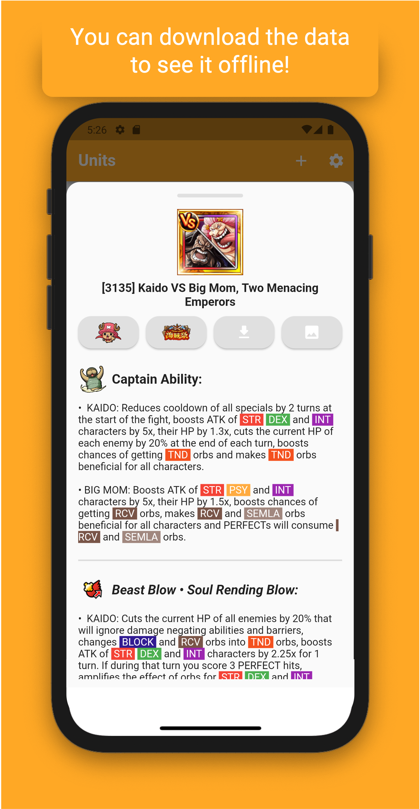
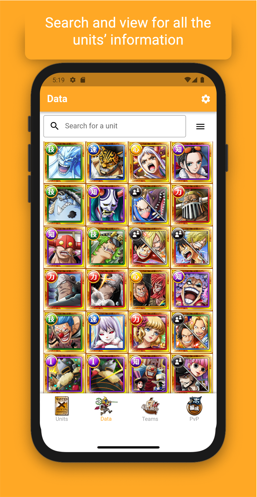
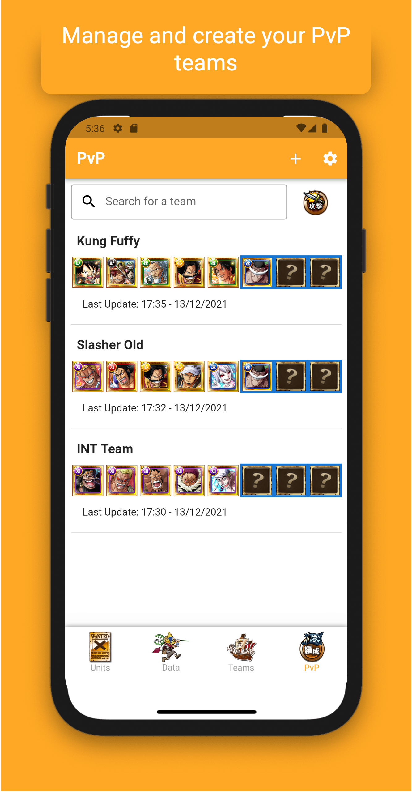
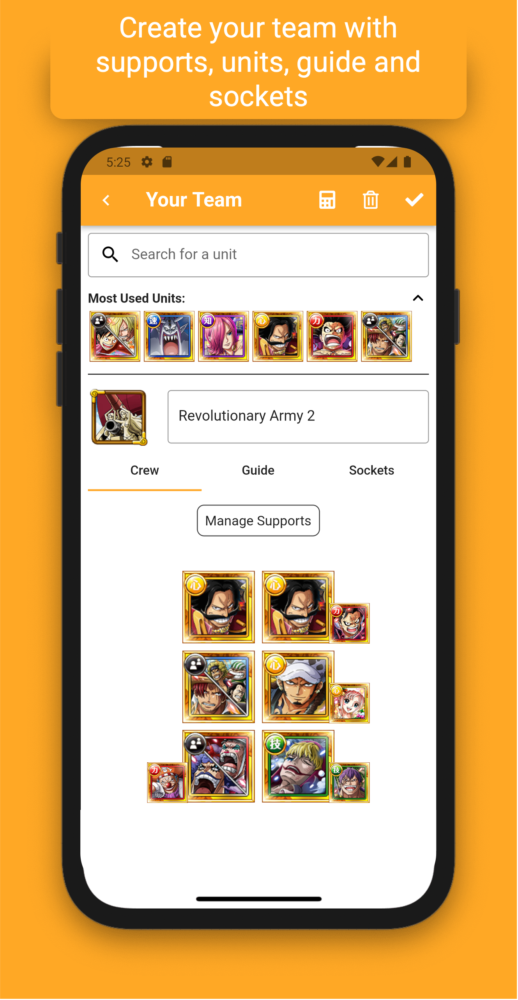
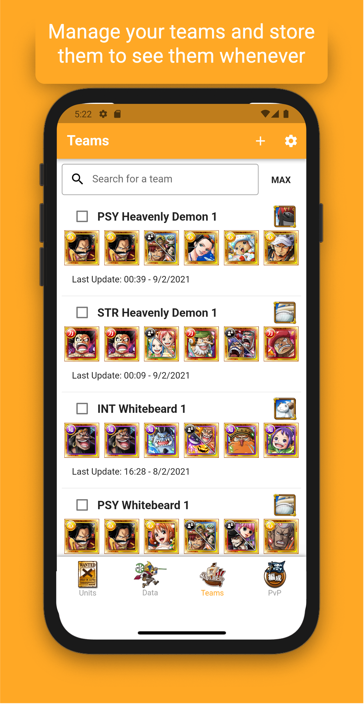
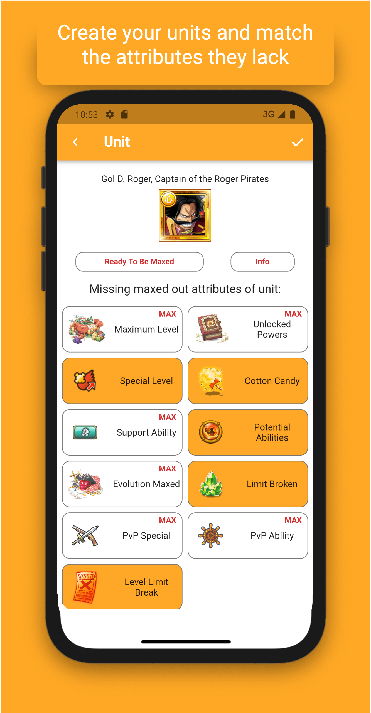
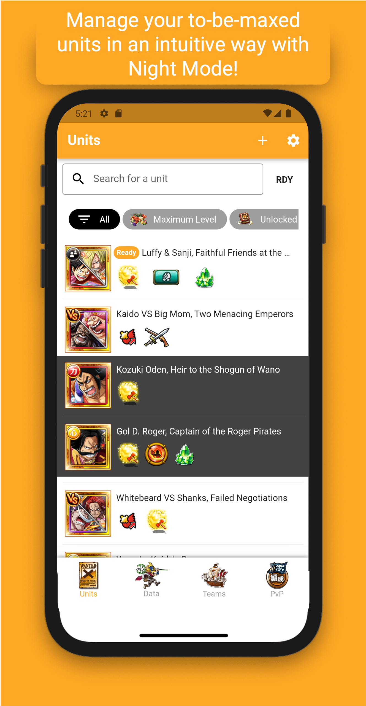

# OP Crew Planner

Find unit's data, build your teams and get a TO-DO list on your to be maxed out units for the mobile game One Piece Treasure Cruise. Get One Piece Treasure Cruise on [Google Play](https://play.google.com/store/apps/details?id=com.namcobandaigames.spmoja010E) or [App Store](https://apps.apple.com/es/app/one-piece-treasure-cruise/id943690848).

    

## Screenshots

  
  
  
  

  
  
  

## Making your own OP Crew Planner

If you want to replicate this app on your device with a custom back-end (take a look at [this documentation](https://github.com/gabrielglbh/OP-Crew-Planner/blob/main/UPDATE.md)), fork the repo and __include your own Google Services files for iOS (`ios/Runner/`) or Android (`android/app/`)__. Make sure your back-end matches the models described in code, although you can also change them to match yours!

If you wish to distribute a new app based on this one, remember to change the Bundle ID on iOS and Package on Android and make sure to acknowledge this work on your newly created app!
- *For iOS*: make sure you create your own Provisioning Profile and Certificate for Apple devices and export them to XCode.
- *For Android*: create the `jks` file for signing using `keytool`, and create the `key.properties` file under `android/` as in the [official documentation](https://flutter.dev/docs/deployment/android#create-an-upload-keystore).

## Including AdMob

In order to include ads in the app, there are a few tokens the developer will need to add on its own to make them work. You will have to create an account on Google Ad Mob, create Banner and Interstitials ads for both Android and iOS and copy the IDs that the console give you.

After that, you will need to register the app through Ad Mob by publishing it to Google Play or App Store respectively.

The following IDs are needed to make the app work with custom ads:

- In [info.plist](https://github.com/gabrielglbh/OP-Crew-Planner/blob/main/ios/Runner/Info.plist):

    - `GOOGLE-iOS-AD-ID`: iOS Application Id from AdMob
    - `GOOGLE-URL-SCHEME`: URL scheme for proper navigation through ads

- In [AndroidManifest.xml](https://github.com/gabrielglbh/OP-Crew-Planner/blob/main/android/app/src/main/AndroidManifest.xml):

    - `GOOGLE-ANDROID-AD-ID`: Android Application Id from AdMob

- In [ads.dart](https://github.com/gabrielglbh/OP-Crew-Planner/blob/main/lib/core/firebase/ads.dart):

    - `GOOGLE-ANDROID-AD-BANNER-ID`: Android banner ID
    - `GOOGLE-iOS-AD-BANNER-ID`: iOS banner ID
    - `GOOGLE-ANDROID-AD-INTERSTITIAL-ID`: Android interstitial ID
    - `GOOGLE-iOS-AD-INTERSTITIAL-ID`: iOS interstitial ID

- In [main.dart](https://github.com/gabrielglbh/OP-Crew-Planner/blob/main/lib/main.dart):

    - `GOOGLE-DEVICE-TESTS-AD`: Id that is prompted in the console when developing to get test ads in the emulator

In case you do not want ads, just remove the file [ads.dart](https://github.com/gabrielglbh/OP-Crew-Planner/blob/main/lib/core/firebase/ads.dart) and all of its instances across all app.

## Language Addition

The language management system is handled by JSON files located under `lib/core/localization/`. Current supported locales: ES, PT, DE, FR and EN.

If you wish to contribute by adding a new language, you must perform these actions:

- Copy and paste an already added language JSON file and create the new language file with the name: `<language_code>.json`.
- Then, add the language into the supported locales in [main.dart](https://github.com/gabrielglbh/OP-Crew-Planner/blob/main/lib/main.dart) under the `EasyLocalization` widget.
- You are good. In case you want to build the app for iOS, you must include the localization in [info.plist](https://github.com/gabrielglbh/OP-Crew-Planner/blob/main/ios/Runner/Info.plist) under the key `CFBundleLocalizations`.